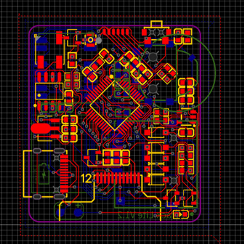
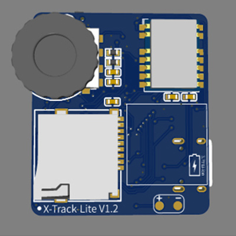
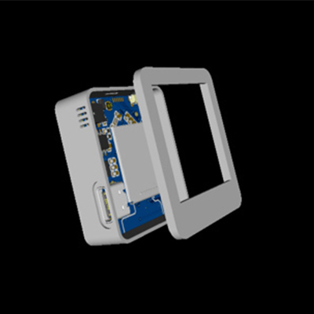

# x-track-lite
A simplified version based on x-track

## 该版本基于原版精简而来， 以实现低成本复刻X-Track大部分功能。致谢：[X-TRACK](https://github.com/FASTSHIFT/X-TRACK)。

## 🍰硬件改动
* MCU：AT32F435CGU7更改为AT32F403ACGT7，单价8。
* IMU&MAG：二者作用不大，已去除。
* GNSS：ATGM336H更改为贴片封装的Air530z，天线通过IPEX引出，单价12。
* Power：LP5907-3.3更改为ME6249A33PG。

## 🍦其他事项
* 原理图及PCB图重新使用立创EDA绘制，建议使用v2版本打样，可直接导出打板文件。
* 其他文件请参考原仓库[X-TRACK](https://github.com/FASTSHIFT/X-TRACK)。
## 🎁渲染图

